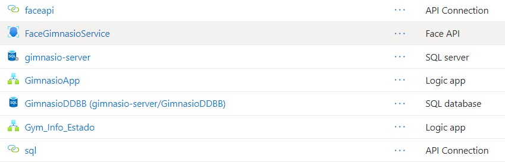
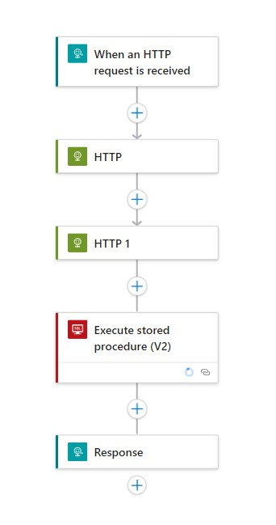
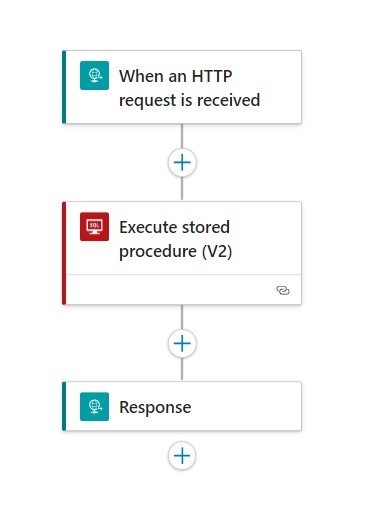
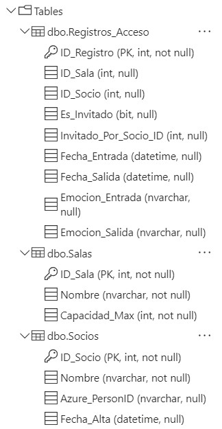
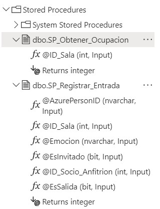
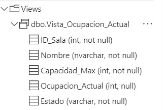
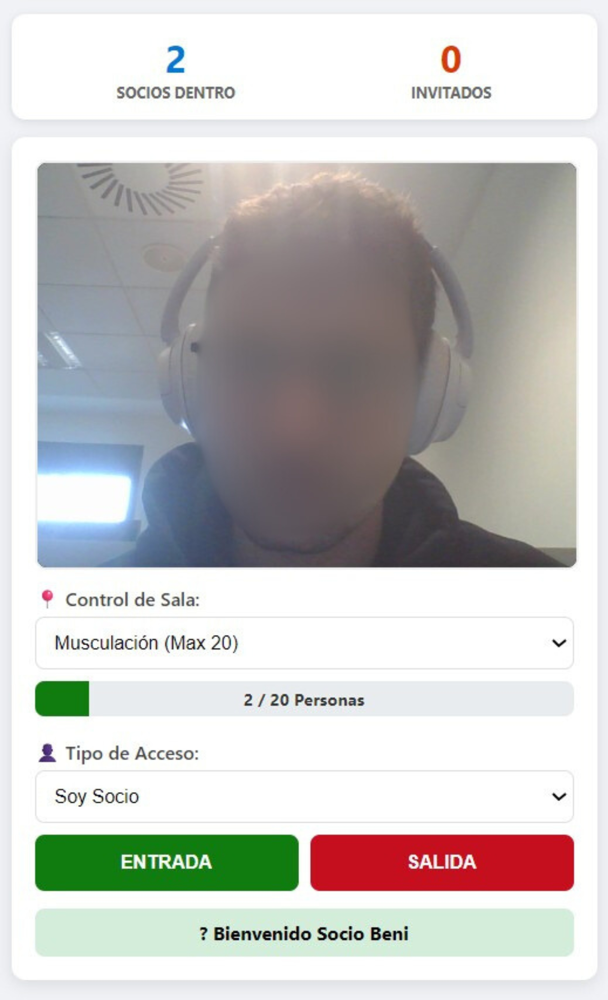
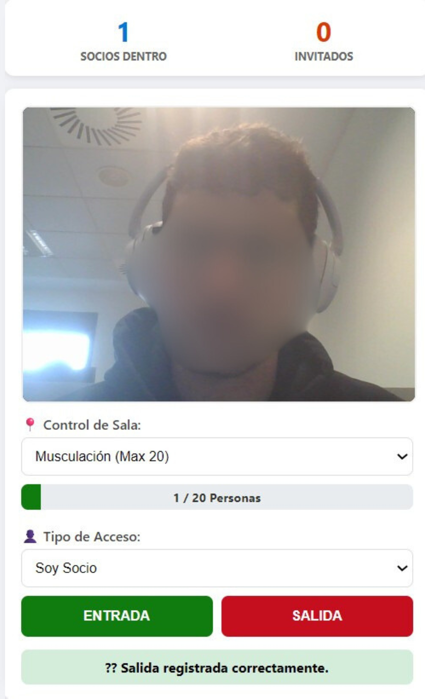
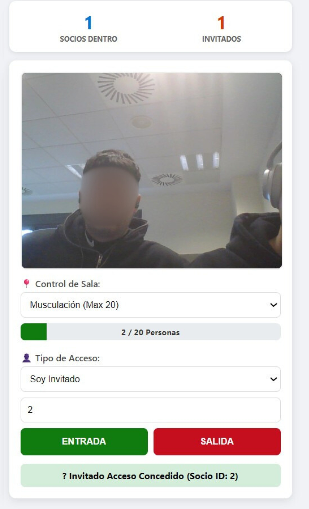
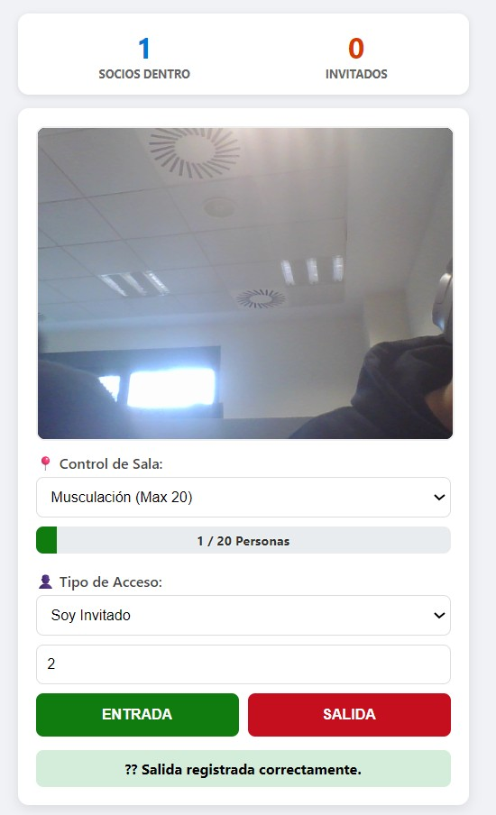

# 🏋️‍♂️ RecognitionFaceGym

### Control de Acceso Biométrico y Gestión de Aforo con Azure AI

> **🚀 VISTA RÁPIDA:** > Puedes consultar el código del panel de control principal aquí: [**📄 index.html**](./index.html)

---

## 📖 Sobre el Proyecto

**RecognitionFaceGym** es una solución "Serverless" para la gestión inteligente de gimnasios. Sustituye las tarjetas de acceso tradicionales por **Reconocimiento Facial**, permitiendo un control de flujo higiénico y seguro.

El sistema no solo valida la identidad, sino que actúa como un **Centro de Mando en Tiempo Real**, gestionando el aforo de múltiples salas (Musculación, Piscina, etc.) y aplicando reglas de negocio complejas para socios e invitados.

---

## ☁️ Arquitectura Cloud (Azure)

El proyecto se despliega al 100% en Microsoft Azure, garantizando escalabilidad y alta disponibilidad.

> **Fig 1.** *Grupo de recursos: Conexiones API, Face API (Cognitive Services), Logic Apps y Azure SQL Database.*

---

## 🧠 Lógica del Backend (Logic Apps)

Utilizamos dos flujos de trabajo orquestados para separar el procesamiento biométrico de la consulta de datos.

### 1. El "Portero": Control de Acceso
Recibe la imagen de la cámara, consulta a la IA para identificar al usuario y ejecuta la transacción en base de datos.

### 2. El "Informador": Microservicio de Aforo
Consulta el estado de todas las salas cada 5 segundos para alimentar el dashboard en vivo.

---

## 🗄️ Base de Datos & Reglas de Negocio (SQL)

El núcleo lógico reside en **Azure SQL Database**. Usamos **Stored Procedures** para encapsular la lógica de negocio y asegurar la integridad de los datos.

### Estructura y Tablas
Diseño relacional para Socios (`Azure_PersonID`), Salas (con límites de capacidad) y Logs de acceso.

### Lógica Programada (Stored Procedures)
Scripts que gestionan las reglas críticas: **Anti-Passback** (no entrar si ya estás dentro) y **Límite de Invitados** (Max 2 por socio).

### Visualización de Datos
Vista de los registros generados tras las pruebas de validación de usuarios.

---

## 📸 Demostración de Uso (Casos de Prueba)

A continuación se muestran los flujos reales de interacción con el sistema mediante la interfaz web.

### 1. Acceso de Socio (Identificación Biométrica)
El sistema captura el rostro, lo compara con el `PersonGroup` de Azure y, si hay coincidencia, devuelve un saludo personalizado.

> **Fig 7.** *El sistema reconoce al usuario y le da la bienvenida por su nombre ("Bienvenido Beni").*

### 2. Salida de Socio
Al registrar la salida, el sistema libera el aforo en tiempo real y actualiza los contadores de la sala correspondiente.

> **Fig 8.** *Confirmación de salida y cálculo de tiempo de estancia.*

### 3. Entrada de Invitado (Gestión de Aforo)
Los invitados acceden vinculados al ID de un socio anfitrión. El dashboard diferencia entre tipos de usuario.

> **Fig 9.** *Acceso concedido a un invitado del Socio con ID 2. Nótese en la barra superior cómo el contador de "Invitados" ha aumentado.*

### 4. Salida de Invitado (Bypass de IA)
Para los invitados, el sistema aplica una lógica diferente: **se salta el reconocimiento facial** (Face Identify) para proteger la privacidad, ya que no existen en la base de datos biométrica, limitándose a validar el ID del anfitrión.

> **Fig 10.** *El sistema procesa la salida del invitado sin realizar identificación facial.*

---

## ✨ Características Principales

* **🔐 Acceso Biométrico:** Entrada sin contacto mediante Azure Face API.
* **⏱️ Tiempo Real:** Dashboard con actualización automática (5s) y semáforos de ocupación.
* **👥 Gestión de Invitados:**
    * Validación de ID del anfitrión.
    * Restricción automática: **Máximo 2 invitados** simultáneos.
* **🛑 Seguridad:** Control de doble acceso (Anti-Passback) y validación de aforo máximo por sala.

---

## 🛠️ Tecnologías

* **Frontend:** HTML5, JavaScript (Vanilla), CSS3.
* **Backend:** Azure Logic Apps.
* **IA:** Azure Cognitive Services (Face API).
* **BBDD:** Azure SQL Database.

---
*Desarrollado por [Alejandro Benitez](https://github.com/alejandrobtez)*
