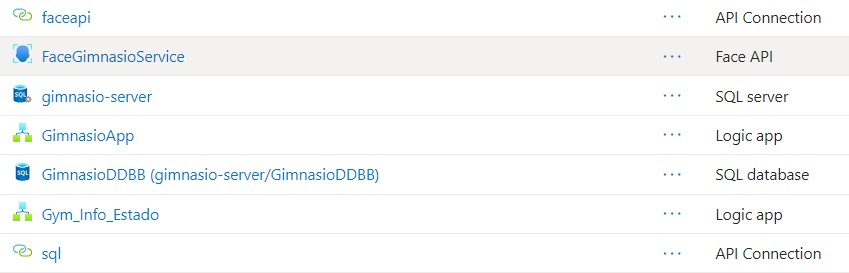
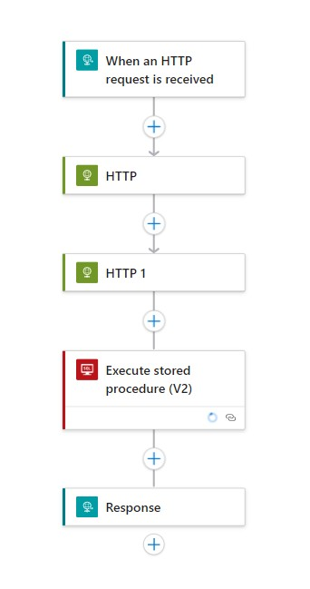
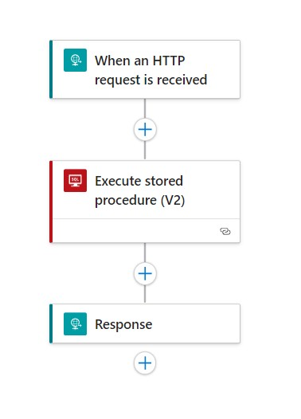
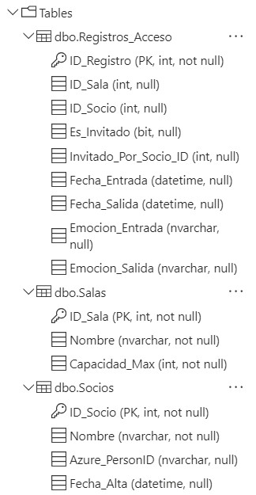
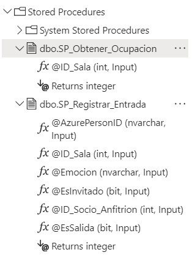
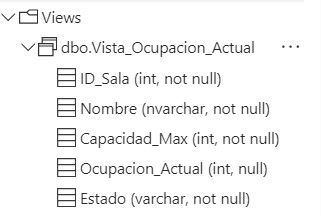
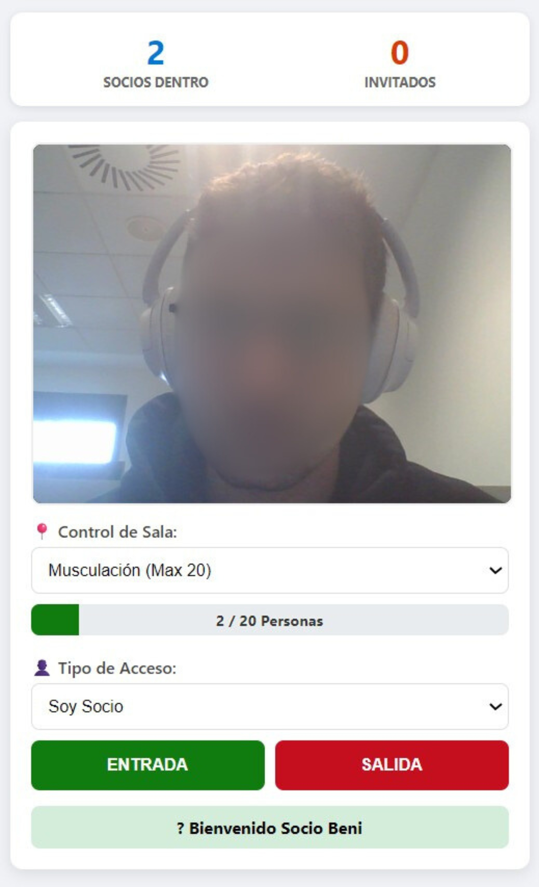
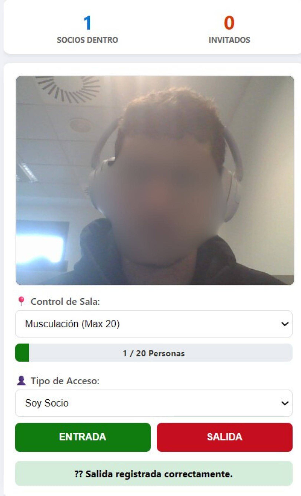
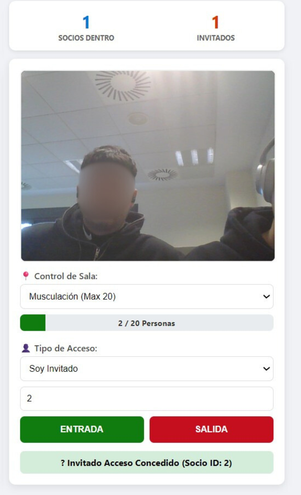
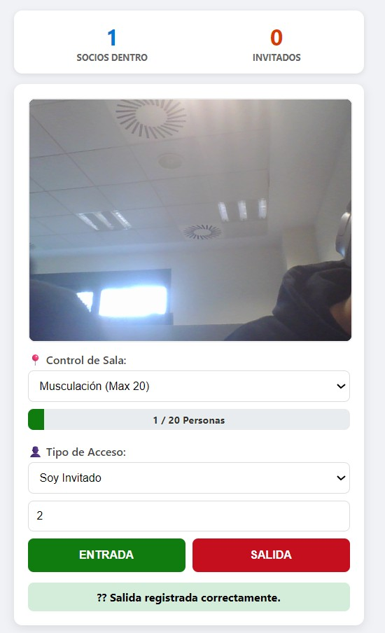

# 🏋️‍♂️ RecognitionFaceGym

### Biometric Access Control and Occupancy Management with Azure AI

> **🚀 QUICK VIEW:** You can check the main control panel code here: [**📄 index.html**](./index.html)

---

## 📖 About the Project

**RecognitionFaceGym** is a "Serverless" solution for intelligent gym management. It replaces traditional access cards with **Facial Recognition**, allowing for a hygienic and secure flow control.

The system not only validates identity but also acts as a **Real-Time Command Center**, managing occupancy for multiple areas (Weight Room, Swimming Pool, etc.) and applying complex business rules for members and guests.

---

## ☁️ Cloud Architecture (Azure)

The project is deployed 100% on Microsoft Azure, guaranteeing scalability and high availability.

> **Fig 1.** *Resource Group: API Connections, Face API (Cognitive Services), Logic Apps, and Azure SQL Database.*

---

## 🧠 Backend Logic (Logic Apps)

We utilize two orchestrated workflows to separate biometric processing from data querying.

### 1. The "Gatekeeper": Access Control
Receives the image from the camera, queries the AI to identify the user, and executes the transaction in the database.

### 2. The "Reporter": Occupancy Microservice
Queries the status of all rooms every 5 seconds to feed the live dashboard.

---

## 🗄️ Database & Business Rules (SQL)

The logical core resides in **Azure SQL Database**. We use **Stored Procedures** to encapsulate business logic and ensure data integrity.

### Structure and Tables
Relational design for Members (`Azure_PersonID`), Rooms (with capacity limits), and Access Logs.

### Programmed Logic (Stored Procedures)
Scripts that manage critical rules: **Anti-Passback** (cannot enter if already inside) and **Guest Limits** (Max 2 per member).

### Data Visualization
View of the records generated after user validation tests.

---

## 📸 Usage Demonstration (Test Cases)

The following sections show real interaction flows with the system through the web interface.

### 1. Member Access (Biometric Identification)
The system captures the face, compares it with the Azure `PersonGroup`, and, if there is a match, returns a personalized greeting.

> **Fig 7.** *The system recognizes the user and welcomes them by name ("Welcome Alejandro").*

### 2. Member Exit
When registering the exit, the system releases occupancy in real-time and updates the corresponding room counters.

> **Fig 8.** *Exit confirmation.*

### 3. Guest Entry (Occupancy Management)
Guests gain access linked to a host member's ID (without facial identification). The dashboard differentiates between user types.

> **Fig 9.** *Access granted to a guest of Member ID 2. Note in the top bar how the "Guests" counter has increased. Only 2 guests are allowed per member.*

### 4. Guest Exit (AI Bypass)
For guests, the system applies a different logic: **it bypasses facial recognition** (Face Identify) to protect privacy, as they do not exist in the biometric database, limiting the process to validating the host ID.

> **Fig 10.** *The system processes the guest exit without performing facial identification.*

---

## ✨ Main Features

* **🔐 Biometric Access:** Contactless entry via Azure Face API.
* **⏱️ Real-Time:** Dashboard with automatic updates (5s) and occupancy traffic lights.
* **👥 Guest Management:**
    * Host ID validation.
    * Automatic restriction: **Maximum of 2 simultaneous guests**.
* **🛑 Security:** Anti-Passback control and maximum occupancy validation per room.

---

## 🛠️ Technologies

* **Frontend:** HTML5.
* **Backend:** Azure Logic Apps.
* **AI:** Azure Cognitive Services (Face).
* **Database:** Azure SQL Database.

---
*Developed by [Alejandro Benitez](https://github.com/alejandrobtez)*

## 📄 License

This project is licensed under the MIT License - see the [LICENSE](LICENSE) file for details.
